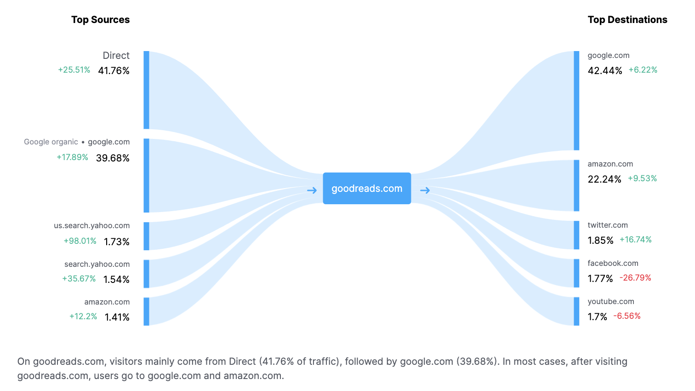

# GoodReads Recommendation Systems


## Citations
* Mengting Wan, Julian McAuley, "Item Recommendation on Monotonic Behavior Chains", in RecSys'18. [bibtex]
* Mengting Wan, Rishabh Misra, Ndapa Nakashole, Julian McAuley, "Fine-Grained Spoiler Detection from Large-Scale Review Corpora", in ACL'19. [bibtex]
* SEMrush. "Goodreads.com - Overview." SEMrush, https://www.semrush.com/website/goodreads.com/overview/
* McLean, Kristen. "Book Sales in the U.S. Are Stronger Than Ever." Publishers Weekly, 19 Apr. 2022, https://www.publishersweekly.com/pw/by-topic/industry-news/bookselling/article/89040-book-sales-in-the-u-s-are-stronger-than-ever.html

## Instructions for Viewing this Project
Viewers should read/work in this order:
1. Read Me
2. [Data](https://mengtingwan.github.io/data/goodreads.html) (only if you want to download the data I used)
3. Capstone Presentation.pdf (optional)
4. data_prep.ipynb
5. Content_Based.ipynb

## Background
GoodReads is a centralized location for users to research books. It contains data such as summaries, ISBN, authors, page number, all versions of that book, etc. Critically, it is also a user-driven site: it aggregates user ratings, and allows users to post written reviews. It plays a crucial role at the nexus of a user's interest in a book and their transition into a purchaser of said book. As such, it is a middle-man in the lifecycle of a potential book sale. As you can see in the image below from SEMrush, a web traffic tracking site,  42% of users go directly to GoodReads, and 40% of them come from a Google search. After using the site, 42% go back to Google, and 22% go to Amazon. That 22% of people are likely going to Amazon to consider buying the book they were looking at. For the users who go back to Google, it is also possible that they plan to make purchases in another way. 



GoodReads' power should also be placed in the context of the book industry as a whole. Publishers Weekly reports that sales of print books were the highest they've ever been since the trade magazine began collecting data in 2004. They note that "led by growth in adult fiction, annual print volume in the U.S. reached 826.6 million units, rising 9% over the prior year. It’s the first time annual sales volume exceeded 800 million units" (McLean). 

## Research Question
GoodReads is a massively popular site, averaging about 230 million views per month AND the book industry is expected to continue its impressive growth (SEMrush) (McLean). As such, GoodReads' ability to provide utility to a user is important to book industry profit. My research question is: can I build an accurate recommendation system for users? I will build two recommendation systems: a content-based recommender which takes in a book title and returns books similar to that book, and a collaborative filteirng recommender which finds users who are similar to each other and recommends what the others haven't read.

## Data Understanding
My data can be found [here](https://mengtingwan.github.io/data/goodreads.html). It was scraped in 2017 by researches Wan and McAuley. 

I use 4 datasets from them. 
1. The dataset 'meta_gr.csv' contains over 2.3 million rows. Each is an individual book, and it has columns with metadata such as isbn, description, links, authors, etc.
2. The dataset 'goodreads_book_genres_initial.json' contains a list of the genres assigned to each book
3. The dataset 'goodreads_book_authors.json' contains a list of all the author names assigned to each book
4. The dataset 'goodreads_reviews_spoiler.json.gz' contains over 1.3 million individual rows. Each row is one user's text review and rating out of 5 for one specific book

## Data Preparation
From my four datasets I was able to clean 3 datasets of interest for my two recommendation systems. 

A. First I used dataset (1) as the source for user-facing recommendations. As such, it needed all the book metadata. (1) was missing genres so I used dataset (2) to add in genre data, joining on the shared book_ids. I did the same using dataset (3) for authors' names. I then dropped some nonsense values from publication year. 

B. Next I used dataset (4) to create a per-user rating dataset. I grouped by user, ending up with one row per user. I concatenated all their review text, then subsetted to just users who had written at least 5 reviews.

C. Finally, I combined datasets (A) and the pre-subsetted (B) into a per-book metadata + reviews dataset. I basically combined all the metadata for each book + all their text data (user reviews and summaries) into one dataframe. I removed nulls in text and genre data, then imputed nulls in page numbers using the genre-specific averages. This resulted in one row per book. 

Dataset (B) was used for collaborative filtering, and dataset (C) was used for content-based. Dataset (A) was used in both to return recommendations.

## Content-Based
A content-based recommendation system uses various features of the products to calculate similarity scores that can be used to return the top most similar products to an inputted product. In this case, a user will be prompted to enter a book title and how many recommendations they would like, then my recommender system will return that number of similar books as recommendations. 

In my model the following features were used:
1. Concatenated text data consisting of the summary of a book and all of the text reviews of said book. I NLP processed that text data by lemmatizing it using WordNetLemmatizer (bringing the words down to their semantic stems, so that words like charged and charging become charg), removing stop words (non-semantic words), grabbing only words that are 3+ letters long, and tokenizing using RegExpTokenizer. Text data is invaluable in providing detail about a book: for example, if many users mention the word 'horse' in their reviews, we know that that book has something to do with animals. Then, the recommender system might find other books that mention 'horse'.

   This text data was then vectorized using TfidfVectorizer. This type of vectorizer is very powerful for content-based classification because adds importance weight to certain tokens using a tf-idf score. The higher the tf-idf score, the more important that word is in that document compared to how important it is in all the documents.
   
3. The book's average rating out of 5. Some users may be interested only in what others consider high-quality writing. 
4. The total count of ratings - i.e., how many users had rated that book. This feature was essentially a proxy for book popularity. More ratings = a more read book. Obviously, some users may prefer to read/be recommended more mainstream books, and some may prefer indie books.
5. The number of pages that that book had. Presumably, some users prefer longer vs. shorter books
6. The genre of the books were one-hot encoded out. 10 different genres were found.

## Conclusion
My content-based recommender was able to return very similar recommendations. My example used is the book ['Good Harbor' by Anita Diamant](https://www.goodreads.com/en/book/show/25717). This book describes "two women friends... sharing their personal histories and learning life's lessons." One character is "maternal and steady, a devoted children's librarian, a convert to Judaism, and mother to two grown sons. When her serene life is thrown into turmoil" the other "realizes that her husband and young daughter are becoming increasingly distant." This summary is strikingly similar to the plots of all 5 recommended books.:
- ["Vinegar Hill" by A. Manette Ansay](https://goodreads.com/book/show/4352215): is about a wife "Dutifully accompanying her unemployed husband... endur[ing] an all-pervading darkness that threatens to destroy everything she is and everyone she loves"
- ["Echo House" by Ward Just](https://www.goodreads.com/en/book/show/2189204): is about "three powerful generations of men in Washington, D.C., as they pursue power, money, and women"
- ["The Heaviness of Things That Float" by Jennifer Manuel"](https://goodreads.com/book/show/29044469): is about "the lonely world of Bernadette, a woman... with no immediate family of her own" but a "community" and a "young man that Bernadette loves like a son is missing. The community is thrown into upheaval, and with the surface broken, raw dysfunction, pain and truths float to the light.
- ["The House on Swiss Avenue" by Irene Sandell](https://goodreads.com/book/show/20336442) is about "two women together to unlock secrets that alter each of their lives," one of them "Adeline Sinclair has spent a lifetime devoted to memories and to the history of her family"
- ["The Waiting Place" by Sharon Arrksey](https://goodreads.com/book/show/29890955): The protagonist is described in the first few sentences as such: "As Susan prepares for the birth of her first child, she contemplates her role as a mother, wife, and partner on the family farm through the lives of the women closest to her"

Clearly my recommendation system has used the feature data (the text data most heavily) to identify books that are set in the modern era, about adult women (mostly) who are going through crisis. Family dynamics are mentioned extensively. And these text examples are only coming from the book summaries, so they are just snippets of the data actually inputted into the model. An additional run of my system on a children's book about animals also returned children's books about animals. Thus, in conclusion, my recommendation system seems to have succeeded in providing similar books to a user's input. 


## Next Steps
GoodReads has so many other metrics that could be added to these recommendation systems in order to make them more accurate and informative. 

For example, a popular feature of the site is the ability to add certain titles to custom 'lists' like a "Want to Read" list. Users can add books that they're interested in to a compiled location that keeps track of which books are next on deck. This action has the potential to represent a datapoint of interest. Books that have been labelled "Want to Read" more often are also probably more popular books. Furthermore, he GoodReads site could be scraped for additional information like book format: Audio, eBook, or print. This would add another feature to the model that would focus in on exactly what kinds of books would be most similar to what a user inputs.

Finally, recommendation systems like this are overall applicable to any site and numerous other types of products.
  
## Repo Structure
```
├── data
│   ├── book_tags.csv
│   ├── books.csv
│   ├── tags.csv
│   ├── to_read.csv
├── Images
│   ├── readme_header.png
│   ├── goodreads_traffic.png
├── data_prep.ipynb
├── data_cleaning_scratch.ipynb
├── Content_Based.ipynb
├── Collaborative_Filtering.ipynb
├── Capstone Presentation.pdf
├── .gitignore
├── LICENSE
├── README.md
```

